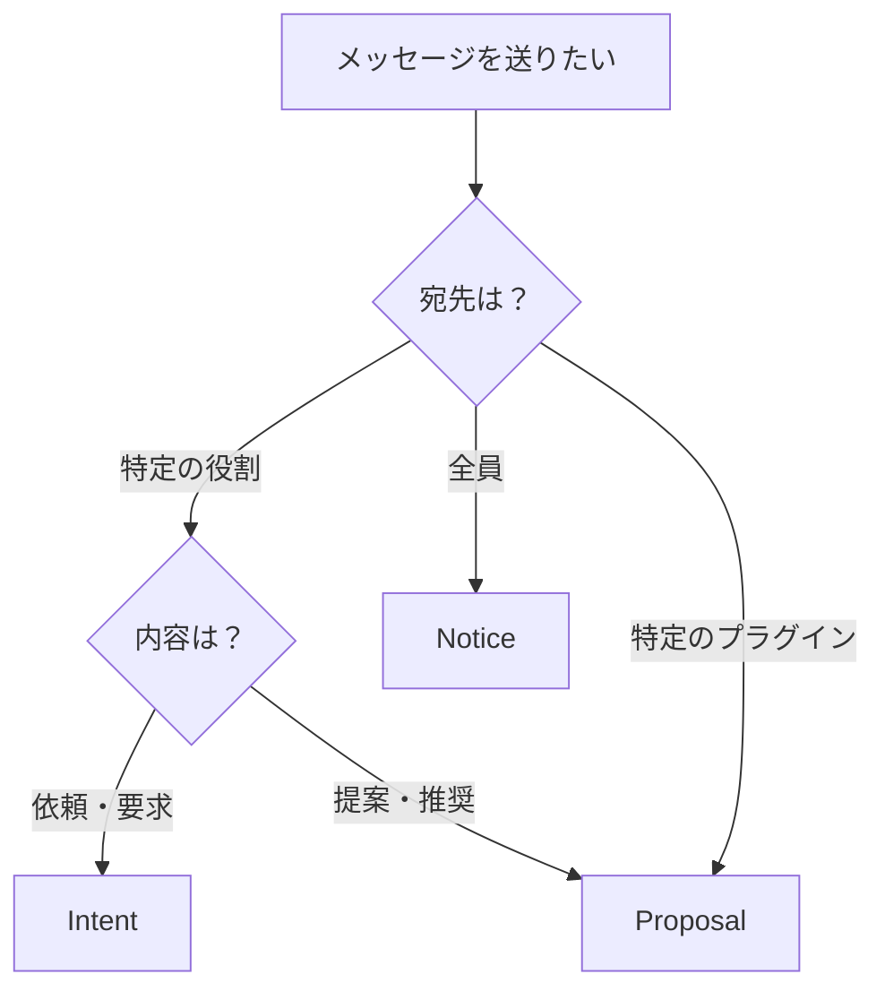

# Message Classification Design Phase 2.0
## Intent/Notice/Proposal 3パターン分類システム

**Version**: 2.0  
**Date**: 2025-01-07  
**Philosophy**: 完全自律存在モデル  

---

## 🌟 核心: たった3つのコミュニケーションパターン

VoidCoreの世界では、すべてのメッセージは以下の3つのパターンのいずれかに分類されます。

---

## 📨 1. Intent (意図) - 「〜してほしい」

### 概要
特定の役割を持つプラグインに対して、何かをしてほしいという**願い**を伝えるメッセージ。

### 特徴
- **通信パターン**: 1対1（役割指定）
- **強制力**: なし（相手の自由意志）
- **応答**: 期待するが必須ではない

### メッセージ構造
```javascript
{
  type: "Intent",
  target_role: "file_explorer",  // 役割を指定
  action: "file.open",
  payload: {
    path: "/documents/report.txt",
    mode: "read"
  }
}
```

### 使用例
- 「ファイルを開いてほしい」→ ファイルエクスプローラーへ
- 「テキストを保存してほしい」→ ストレージサービスへ
- 「画像を表示してほしい」→ 画像ビューアーへ

### 実装のポイント
```javascript
// 送信側
core.publish({
  type: "Intent",
  target_role: "editor",
  action: "text.format",
  payload: { format: "markdown" }
})

// 受信側（roleが一致する場合のみ処理）
core.subscribe("Intent", (message) => {
  if (message.target_role === this.role) {
    this.handleIntent(message)
  }
})
```

---

## 📢 2. Notice (通知) - 「〜が起きた」

### 概要
世界全体に向けて、起きた出来事や状態変化を**事実**として放送するメッセージ。

### 特徴
- **通信パターン**: 1対多（ブロードキャスト）
- **強制力**: なし（聞く側の自由）
- **応答**: 期待しない

### メッセージ構造
```javascript
{
  type: "Notice",
  event_name: "file.saved",
  payload: {
    path: "/documents/report.txt",
    size: 2048,
    timestamp: "2025-01-07T10:30:00Z"
  }
}
```

### 使用例
- 「ファイルが保存された」→ 全プラグインへ通知
- 「ユーザーがボタンをクリックした」→ 全プラグインへ通知
- 「メモリ使用率が80%を超えた」→ 全プラグインへ通知

### 実装のポイント
```javascript
// 送信側（誰が聞いているか気にしない）
core.publish({
  type: "Notice",
  event_name: "user.action",
  payload: { action: "save", target: "document" }
})

// 受信側（興味があるイベントのみ購読）
core.subscribe("Notice", "file.saved", (message) => {
  this.updateFileList(message.payload)
})
```

---

## 💡 3. Proposal (提案) - 「〜しませんか」

### 概要
特定のプラグインに対して、行動や状態変更を**提案**するメッセージ。相手は自由に判断できる。

### 特徴
- **通信パターン**: 1対1（プラグイン指定）
- **強制力**: なし（あくまで提案）
- **応答**: 任意（承諾/拒否/無視）

### メッセージ構造
```javascript
{
  type: "Proposal",
  target_plugin: "VideoProcessor_001",  // 特定のプラグインID
  suggestion: "pause",
  payload: {
    reason: "システムメモリ不足",
    recommended_action: "一時停止して5秒後に再開"
  }
}
```

### 使用例
- 「処理を一時停止しませんか」→ 重い処理をしているプラグインへ
- 「キャッシュをクリアしませんか」→ メモリを多く使っているプラグインへ
- 「設定を変更しませんか」→ 特定の設定を持つプラグインへ

### 実装のポイント
```javascript
// 送信側（特定のプラグインへ提案）
core.publish({
  type: "Proposal",
  target_plugin: "HeavyProcessor_42",
  suggestion: "reduce_quality",
  payload: { 
    current_load: 95,
    suggested_quality: "medium"
  }
})

// 受信側（自分宛の提案のみ検討）
core.subscribe("Proposal", (message) => {
  if (message.target_plugin === this.pluginId) {
    this.considerProposal(message)
  }
})
```

---

## 🔄 メッセージパターン選択ガイド

### どのパターンを使うべきか？



### 判断基準

1. **Intent を使う場合**
   - 特定の機能を持つプラグインに作業を依頼したい
   - 役割ベースで宛先を決めたい
   - 何かを実行してほしい

2. **Notice を使う場合**
   - 起きた出来事を共有したい
   - 誰が聞いているか分からない/気にしない
   - 状態変化を通知したい

3. **Proposal を使う場合**
   - 特定のプラグインに行動変更を促したい
   - 強制ではなく提案として伝えたい
   - 相手の判断を尊重したい

---

## 🎯 実装例: 完全な3パターン対応プラグイン

```javascript
class SmartPlugin extends AutonomousPlugin {
  constructor(core) {
    super(core, "SmartService")
    this.role = "data_processor"
    this.pluginId = `SmartPlugin_${Date.now()}`
  }
  
  async observe() {
    // Intent: 自分の役割宛のメッセージを処理
    this.subscribe("Intent", (msg) => {
      if (msg.target_role === this.role) {
        this.handleIntent(msg)
      }
    })
    
    // Notice: 興味のあるイベントを購読
    this.subscribe("Notice", "data.updated", (msg) => {
      this.onDataUpdate(msg.payload)
    })
    
    // Proposal: 自分宛の提案を検討
    this.subscribe("Proposal", (msg) => {
      if (msg.target_plugin === this.pluginId) {
        this.considerProposal(msg)
      }
    })
  }
  
  async work() {
    // Notice: 処理完了を通知
    this.publish({
      type: "Notice",
      event_name: "processing.completed",
      payload: { items: 100, duration: 5.2 }
    })
    
    // Intent: 保存を依頼
    this.publish({
      type: "Intent",
      target_role: "storage",
      action: "data.save",
      payload: { data: this.processedData }
    })
    
    // Proposal: 他のプラグインに最適化を提案
    this.publish({
      type: "Proposal",
      target_plugin: "Visualizer_001",
      suggestion: "enable_cache",
      payload: { expected_speedup: "3x" }
    })
  }
}
```

---

## 📊 パターン比較表

| 項目 | Intent | Notice | Proposal |
|------|--------|--------|----------|
| 日本語 | 意図・願い | 通知・報告 | 提案・推奨 |
| 宛先 | 役割（role） | 全員 | 特定プラグイン |
| 通信 | 1対1 | 1対多 | 1対1 |
| 例文 | 「開いてください」 | 「開きました」 | 「閉じませんか？」 |
| 応答 | 期待する | 期待しない | 任意 |
| 強制力 | なし | なし | なし |

---

## 🚀 移行ガイド

### 既存コードからの移行

```javascript
// 旧: 汎用的なpublish
core.publish("some.event", data)

// 新: 明確な分類
// Intent版
core.publish({
  type: "Intent",
  target_role: "processor",
  action: "some.event",
  payload: data
})

// Notice版
core.publish({
  type: "Notice",
  event_name: "some.event",
  payload: data
})

// Proposal版
core.publish({
  type: "Proposal",
  target_plugin: "Plugin_123",
  suggestion: "some.event",
  payload: data
})
```

---

## 🌟 まとめ

この3パターン分類により：

1. **意図が明確に**: メッセージの目的が一目で分かる
2. **実装が簡単に**: パターンに従うだけで適切な通信が可能
3. **拡張が自由に**: 3パターンの中で無限のバリエーション

**Remember**: すべては「願い」「事実」「提案」のいずれか。強制や命令は存在しない！