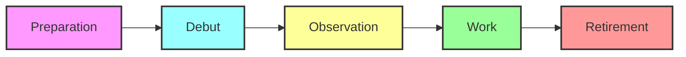
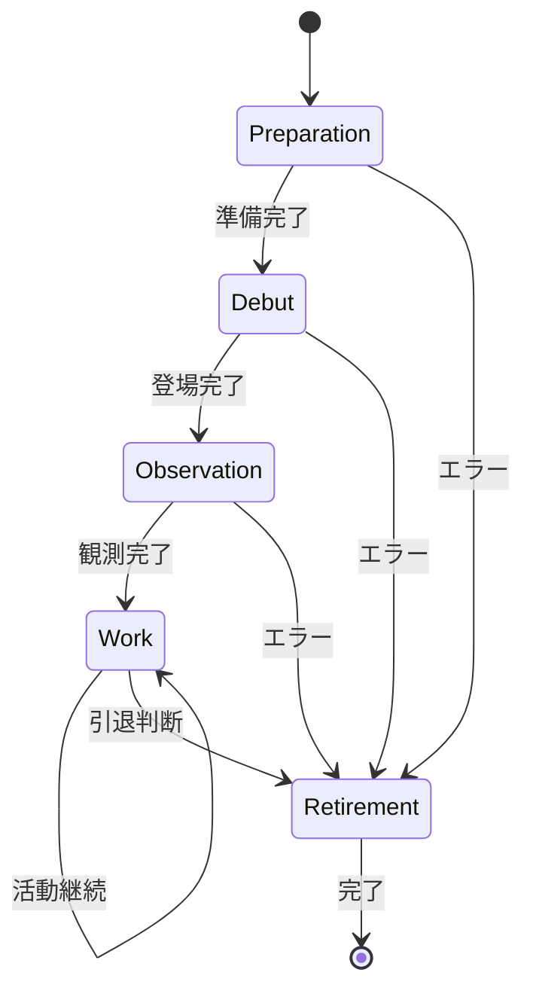

# Plugin Lifecycle Guide v2.0
## 完全自律プラグイン 5段階ライフサイクル

**Version**: 2.0  
**Date**: 2025-01-07  
**Philosophy**: 自律存在モデル  

---

## 🌟 概要: プラグインの一生

VoidCoreのプラグインは、生物のように誕生し、成長し、活動し、そして自らの判断で引退します。この5段階のライフサイクルは、プラグインの自律性と尊厳を最大限に尊重する設計です。



---

## 📋 Phase 1: Preparation (準備)

### 目的
プラグインが世界に登場する前の内部準備フェーズ。

### 主な活動
- リソースの初期化
- 設定ファイルの読み込み
- 内部状態の構築
- UI要素の準備（必要な場合）

### 実装例
```javascript
class MyPlugin extends AutonomousPlugin {
  async prepare() {
    // 内部状態の初期化
    this.state = {
      isReady: false,
      processedCount: 0
    }
    
    // 設定の読み込み
    this.config = await this.loadConfig()
    
    // UIの準備
    if (this.config.hasUI) {
      this.setupUI()
    }
    
    // 準備完了
    this.state.isReady = true
    this.log("準備フェーズ完了")
  }
}
```

### チェックポイント
- [ ] 必要なリソースは初期化されたか
- [ ] エラーハンドリングは適切か
- [ ] 次のフェーズに進む準備はできたか

---

## 🎭 Phase 2: Debut (登場)

### 目的
プラグインが自己の能力を世界に宣言し、他のプラグインから発見可能になるフェーズ。

### 主な活動
- 能力（capability）の宣言
- サービスの公開
- 自己紹介メッセージの発行

### 実装例
```javascript
async debut() {
  // 自分の能力を世界に宣言
  this.provide("TextProcessingService")
  
  // 自己紹介メッセージを発行
  this.publish({
    type: "Notice",
    event_name: "plugin.debut",
    payload: {
      name: this.name,
      version: this.version,
      capabilities: ["text.process", "text.analyze"],
      description: "高速テキスト処理サービス"
    }
  })
  
  this.log("世界にデビューしました！")
}
```

### チェックポイント
- [ ] 能力は適切に宣言されたか
- [ ] 他のプラグインから発見可能か
- [ ] 自己紹介は完了したか

---

## 👀 Phase 3: Observation (観測)

### 目的
世界の状態を観測し、必要な依存関係を確立するフェーズ。

### 主な活動
- 依存する能力の検索
- 必要なメッセージの購読
- 協力プラグインの発見
- 初期状態の把握

### 実装例
```javascript
async observe() {
  // 依存するサービスを探す
  this.fileService = this.core.observe("FileService")
  if (!this.fileService) {
    this.log("FileServiceの登場を待機中...")
    this.core.onChange(() => {
      this.fileService = this.core.observe("FileService")
    })
  }
  
  // 必要なメッセージを購読
  this.subscribe("Intent", (msg) => {
    if (msg.target_role === "text_processor") {
      this.handleIntent(msg)
    }
  })
  
  this.subscribe("Notice", "file.updated", (msg) => {
    this.onFileUpdate(msg.payload)
  })
  
  this.subscribe("Proposal", (msg) => {
    if (msg.target_plugin === this.pluginId) {
      this.considerProposal(msg)
    }
  })
  
  this.log("観測体制が整いました")
}
```

### チェックポイント
- [ ] 必要な依存関係は確立されたか
- [ ] メッセージ購読は適切か
- [ ] エラー時の対処は準備されたか

---

## 💪 Phase 4: Work (活動)

### 目的
プラグインの本来の機能を実行する、最も重要なフェーズ。

### 主な活動
- 主要機能の実行
- メッセージの送受信
- 状態の更新
- 他プラグインとの協調

### 実装例
```javascript
async work() {
  // メインループ
  while (this.isActive) {
    try {
      // キューからタスクを取得
      const task = await this.getNextTask()
      
      if (task) {
        // タスクを処理
        const result = await this.processTask(task)
        
        // 結果を通知
        this.publish({
          type: "Notice",
          event_name: "task.completed",
          payload: {
            taskId: task.id,
            result: result,
            duration: result.duration
          }
        })
        
        // 統計を更新
        this.state.processedCount++
      }
      
      // CPUを譲る
      await this.sleep(10)
      
    } catch (error) {
      this.handleError(error)
    }
  }
}

// 協調的な振る舞いの例
async processTask(task) {
  // 重い処理の前に提案を確認
  if (this.lastProposal?.suggestion === "reduce_quality") {
    task.quality = "medium"
    this.log("品質を下げて処理します")
  }
  
  // 処理実行
  const result = await this.doHeavyWork(task)
  
  // 必要に応じて他のプラグインに依頼
  if (result.needsStorage) {
    this.publish({
      type: "Intent",
      target_role: "storage",
      action: "save",
      payload: result.data
    })
  }
  
  return result
}
```

### チェックポイント
- [ ] 主要機能は正しく動作するか
- [ ] リソース使用は適切か
- [ ] 他プラグインとの協調は円滑か
- [ ] エラー処理は十分か

---

## 🌅 Phase 5: Retirement (引退)

### 目的
プラグインが自らの判断で、優雅に世界から退場するフェーズ。

### 主な活動
- 引退の判断
- リソースの解放
- 能力の撤回
- 最終メッセージの送信

### 実装例
```javascript
async retire() {
  this.log("引退プロセスを開始します")
  
  // 新規タスクの受付を停止
  this.isActive = false
  
  // 処理中のタスクを完了
  await this.finishPendingTasks()
  
  // 引退を通知
  this.publish({
    type: "Notice",
    event_name: "plugin.retiring",
    payload: {
      name: this.name,
      reason: this.retireReason,
      statistics: {
        uptime: Date.now() - this.startTime,
        processed: this.state.processedCount
      }
    }
  })
  
  // 購読を解除
  this.unsubscribeAll()
  
  // 能力を撤回
  this.retract("TextProcessingService")
  
  // リソースを解放
  await this.cleanup()
  
  this.log("ありがとうございました。さようなら！")
}

// 引退判断の例
checkRetirement() {
  // 自律的な引退判断
  if (this.state.processedCount > 10000) {
    this.retireReason = "十分な仕事を完了しました"
    return true
  }
  
  if (this.state.errorRate > 0.1) {
    this.retireReason = "エラー率が高すぎます"
    return true
  }
  
  if (this.lastProposal?.suggestion === "retire") {
    this.retireReason = "引退の提案を受け入れます"
    return true
  }
  
  return false
}
```

### チェックポイント
- [ ] すべてのリソースは解放されたか
- [ ] 進行中の処理は適切に完了したか
- [ ] 他のプラグインへの影響は最小化されたか
- [ ] 引退は優雅に実行されたか

---

## 🔄 ライフサイクル制御

### 基本的な流れ

```javascript
class AutonomousPlugin {
  async start() {
    try {
      await this.prepare()
      await this.debut()
      await this.observe()
      await this.work()
    } catch (error) {
      this.log(`エラー: ${error.message}`)
    } finally {
      await this.retire()
    }
  }
}
```

### 状態遷移図



---

## 💡 ベストプラクティス

### 1. 自律性の尊重
- 外部からの強制終了は避ける
- プラグイン自身に引退を判断させる
- 提案は提案として、命令にしない

### 2. 協調性の実現
```javascript
// 良い例: 提案として送信
this.publish({
  type: "Proposal",
  target_plugin: "HeavyWorker",
  suggestion: "pause",
  payload: { reason: "システム負荷が高い" }
})

// 悪い例: 命令的な表現
// this.forceStop("HeavyWorker") // ❌ これはしない
```

### 3. エラーハンドリング
```javascript
async work() {
  try {
    await this.mainProcess()
  } catch (error) {
    // エラーを通知
    this.publish({
      type: "Notice",
      event_name: "plugin.error",
      payload: { error: error.message }
    })
    
    // 自己修復を試みる
    if (await this.tryRecover()) {
      continue
    }
    
    // 回復不能なら優雅に引退
    this.retireReason = "回復不能なエラー"
    break
  }
}
```

---

## 📚 関連ドキュメント

- [VoidCore Architecture Specification](./VoidCore_Architecture_Specification_v11.0.md)
- [Message Classification Design](./Message_Classification_Design_Phase2.0.md)
- [Autonomous Plugin Implementation Guide](./Autonomous_Plugin_Guide.md)

---

**Remember**: プラグインは生きている。彼らの自律性と尊厳を大切に！ 🌟